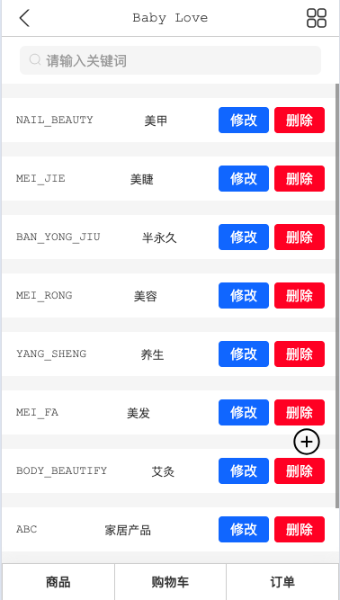
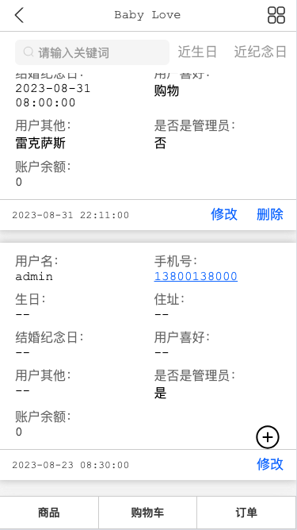

# BabyLove 轻量无支付地摊引流电子商城系统后端服务


## 什么系统？

这是一套移动端地摊引流电子商城系统后端服务，轻量无支付，无需注册支付平台即可使用，主打引流，通过微信下单，添加微信后后续可通过建群、发朋友圈引流，形成网站+微信群+朋友圈等多种组合引流方式，为你的地摊经济添砖加瓦，早日实现被动收入更上一层楼。

## 商城演示

微信扫码：  


## 什么技术？

EggJS + MySQL + Sequelize + node-cache。

## 本地启动

```bash
$ npm i
$ npm run dev
$ open http://localhost:7001/
```

## 部署

```bash
$ npm start
$ npm stop
```

## 预览

### 登录


### 首页


### 导航


### 分类


### 购物车


### 订单


### 用户
